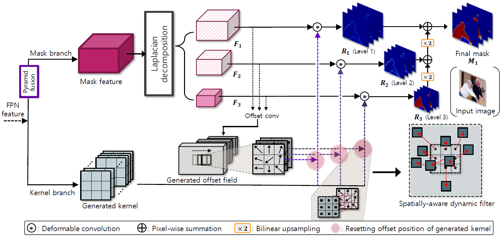
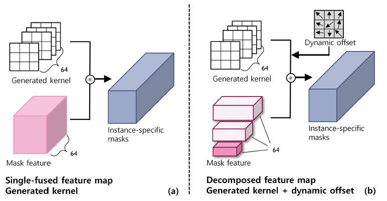
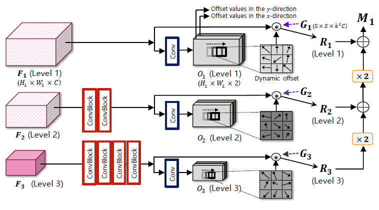
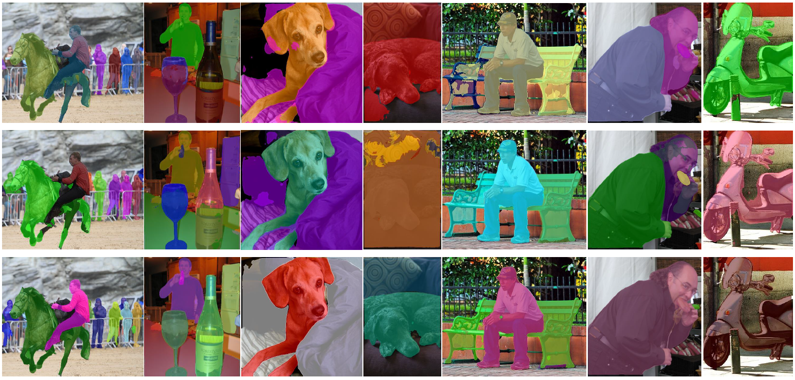

# LapMask
Dynamic Residual Filtering With Laplacian Pyramid for Instance Segmentation

This repository is an oiffical Pytorch implementation of the paper [**"Dynamic Residual Filtering With Laplacian Pyramid for Instance Segmentation"**](https://ieeexplore.ieee.org/document/9921322)

Minsoo Song and [Wonjun Kim*](https://sites.google.com/view/dcvl)  
IEEE Transactions on Multimedia (TMM)

<p align="center">

</p>
The overall architecture of the proposed method for instance segmentation. Mask features are decomposed by utilizing the Laplacian pyramid and corresponding residuals are convolved with deformable filters to restore the global layout and local details of the segmentation map.


Conceptual difference between the previous SOLOv2 and the proposed method. (a) SOLOv2. (b) Ours.


we design spatially-aware convolution filters to progressively capture the residual form of mask features at each level of the Laplacian pyramid while holding deformable receptive fields with dynamic offset information.


## Enviornments

* Python >= 3.8
* Pytorch >= 1.11.0
* Ubuntu >= 16.04
* CUDA >= 10.2
* cuDNN (if CUDA available)

some other packages: [Detectron2](https://github.com/facebookresearch/detectron2), [AdelaiDet](https://github.com/aim-uofa/AdelaiDet), opencv

## Build development environment
```bash
python setup.py build develop
```
Note. 
* If you use pytorch 1.10 in CUDA <= 11.1 version, there will be an error during the build process. So the file "workspace/Lapmask_source/adet/layers/csrc/ml_nms/ml_nms.cu" must be replaced with a file inside "ml_nms_old.zip" attached to the corresponding folder.

## Pretrained models
We proivde pre-trained ResNet-101 and VoVNet-57 weights for COCO dataset. These models are trained on 4x Titan X GPUs. This is a reimplementation and the quantitative results are slightly different from our original paper.
* [ResNet-101_coco](https://1drv.ms/u/s!An562j_-CwpPgjvdyDSyShXBPHMY?e=ON6TBG)
* [VoVNet-57_coco](https://1drv.ms/u/s!An562j_-CwpPgjosnjIEBlK7x7Ol?e=5z8otr)

   Name |  mask AP | AP<sub>50</sub> | AP<sub>75</sub> | AP<sub>S</sub> | AP<sub>M</sub> | AP<sub>L</sub>
   :-- |:---:|:---:|:---:|:---:|:---:|:---:
   [LapMask_R101](configs/LapMask/R101_3x.yaml) | 41.2 | 62.3 | 44.6 | 20.5 | 44.7 | 56.0 
   [LapMask_V-57](configs/LapMask/V_57_3x.yaml) | 41.6 | 62.5 | 45.2 | 21.9 | 44.8 | 55.2 

## Dataset Preparation
We used COCO Dataset for model training/validation on Detectron2 platform.

### COCO Dataset
**1. [Official download site](https://cocodataset.org/#download)**  
   * Download official COCO dataset and make the directory.
   * You need train2017, val2017 for training and validation. Test2017 is also required to submit the results to the evaluation server.

COCO data structures are should be organized as below:
```
  |-- (Working Directory)
    |-- datasets
      |-- coco
         |-- annotations
            |-- instances_val2017.json
            |-- instances_train2017.json
            |-- image_info_test-dev2017.json
            |-- image_info_test2017.json
         |-- train2017
            |-- 000000xxxxxx.jpg
            |-- ... (all images in train2017)
         |-- val2017
            |-- 000000xxxxxx.jpg
            |-- ... (all images in val2017)
         |-- test2017
            |-- 000000xxxxxx.jpg
            |-- ... (all images in test2017)
```

## Evaluation
Make sure you downloaded the pre-trained model and placed it in the './' (working directory) before running the evaluation code.
* Evaluation Command Line:
```bash
# Running evaluation using pre-trained models
## ResNet-101 evaluation
OMP_NUM_THREADS=1 python tools/train_net.py --num-gpus 1 --eval-only --config-file configs/LapMask/R101_3x.yaml OUTPUT_DIR training_dir/R101_3x MODEL.WEIGHTS LapMask_R101_pretrained.pth
## VoVNet-57 evaluation
OMP_NUM_THREADS=1 python tools/train_net.py --num-gpus 1 --eval-only --config-file configs/LapMask/V_57_3x.yaml OUTPUT_DIR training_dir/V_57_3x MODEL.WEIGHTS LapMask_V_57_3x_pretrained.pth
```

## Training
```bash
# 4 gpus setting
# COCO
## ResNet-101 training
OMP_NUM_THREADS=1 python tools/train_net.py --num-gpus 4 --config-file configs/LapMask/R101_3x.yaml OUTPUT_DIR training_dir/R101_3x
## VoVNet-57 training
OMP_NUM_THREADS=1 python tools/train_net.py --num-gpus 4 --config-file configs/LapMask/V_57_3x.yaml OUTPUT_DIR training_dir/LapMask_V_57_3x
```

### Qualitative results of the proposed residual filtering scheme shown in COCO dataset.

Results of instance segmentation on the COCO test-dev subset. 1st row: results by SOLOv2. 2nd row: results by SOTR. 3rd row: results by the proposed method. Note that the performance comparison is conducted based on the Detectron2 platform by using the same backbone, i.e., ResNet-101-FPN. Best viewed in color.

More results of the proposed method on the COCO test-dev subset. Note that our masks show reliable performance under diverse real-world scenarios. Best viewed in color.

## Reference
When using this code in your research, please cite the following paper:  

Minsoo Song, G-M. Um, H. K. Lee, J. Seo, and Wonjun Kim*, **"Dynamic residual filtering with Laplacian pyramid for instance segmentation,"** in **IEEE Transactions on Multimedia**, Early Access, doi: 10.1109/TMM.2022.3215306.

```
@ARTICLE{SONG2022103523,
  author={M. {Song}, G-M. {Um}, H. K. {Lee}, J. {Seo}, and W. {Kim}},
  journal={IEEE Transactions on Multimedia}, 
  title={Dynamic Residual Filtering With Laplacian Pyramid for Instance Segmentation},
  month={Oct.},
  year={2022},
  pages = {1-12},
  doi={10.1109/TMM.2022.3215306}}
```

